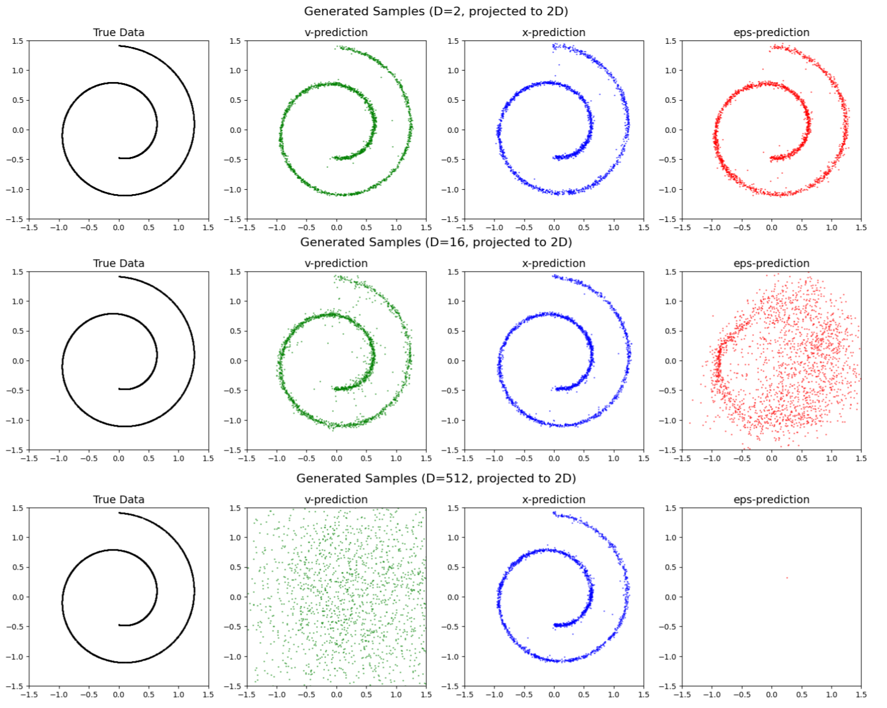

# JiT Paper Toy Example Reproduction

Unofficial reproduction of the toy manifold experiments from:

**"Back to Basics: Let Denoising Generative Models Denoise"**
by Tianhong Li and Kaiming He
arXiv: https://arxiv.org/abs/2511.13720

## What This Reproduces

This repository implements the low-dimensional manifold experiments that demonstrate the **manifold hypothesis** for diffusion models:

This demonstrates that predicting on-manifold targets (clean data x) is fundamentally easier than predicting off-manifold targets (noise ε or velocity v) when data lies on low-dimensional manifolds.

Parts of the implementation have been validated against [this alternative implementation](https://github.com/SUZ-tsinghua/jit_toy_example/).

<p>

</p>


## Installation

This project uses [uv](https://github.com/astral-sh/uv) for dependency management:

```bash
# Install uv if you haven't already
curl -LsSf https://astral.sh/uv/install.sh | sh

# Install dependencies
uv sync
```

## Running

Open and run the notebook:

```bash
uv run jupyter notebook verify_diffusion_manifold.ipynb
```

## Citation

If you use this code, please cite the original paper:

```bibtex
@article{li2025jit,
  title={Back to Basics: Let Denoising Generative Models Denoise},
  author={Li, Tianhong and He, Kaiming},
  journal={arXiv preprint arXiv:2511.13720},
  year={2025}
}
```

## License

This is an unofficial reproduction for research and educational purposes.
